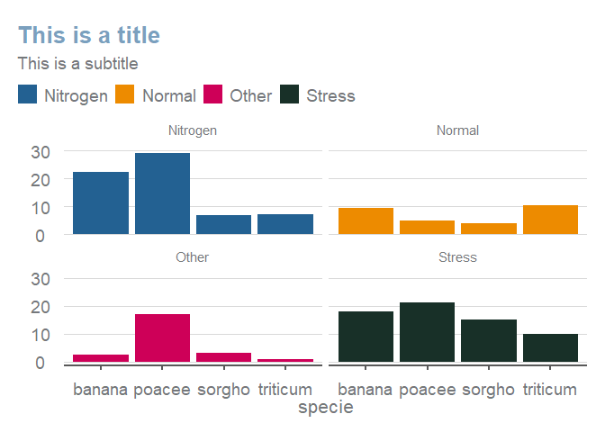

<!-- README.md is generated from README.Rmd. Please edit that file -->

# esctheme

<!-- badges: start -->
<!-- badges: end -->

The goal of esctheme is to create ggplot2 charts in the Essential
Services Commission of Victoria style.

## Installation

You can install the development version of esctheme from
[GitHub](https://github.com/) with:

``` r
# install.packages("devtools")
devtools::install_github("mayala-esc/esctheme")
```

## Example

This is a basic example which shows you how to use the theme:

``` r
library(esctheme)
r_setup()
```



``` r

## basic example code

# create a dataset
esc_colours <- esc_palette()
specie <- c(rep("sorgho" , 4) , rep("poacee" , 4) , rep("banana" , 4) , rep("triticum" , 4))
condition <- rep(c("Normal" , "Stress" , "Nitrogen", "Other") , 4)
value <- abs(rnorm(16 , 0 , 15))
data <- data.frame(specie,condition,value)


data <- data %>% 
  arrange(specie, rev(value)) %>% 
  dplyr::group_by(specie) %>% 
  dplyr::mutate(label_y = cumsum(value)-0.5*value)

# Plot data with ESC style
data %>% 
  ggplot(aes(fill=condition, y=value, x=specie)) + 
  geom_bar(position="stack", stat="identity") +
  scale_fill_manual(values = esc_colours) +
  scale_y_continuous(breaks = round(seq(min(data$value)*0, max(data$value)*3, by = 10),1)) + 
  facet_wrap(~condition) +
  labs(title = "This is a title",
       subtitle = "This is a subtitle") +
  esc_theme(rm_y_leg = TRUE)
```


